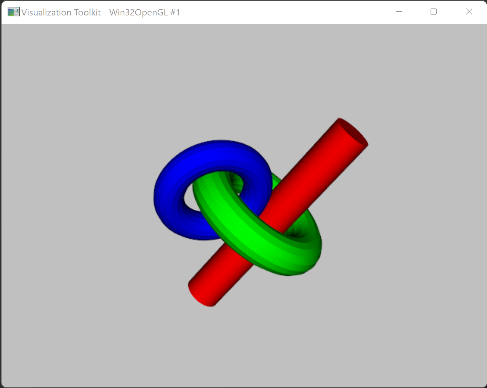
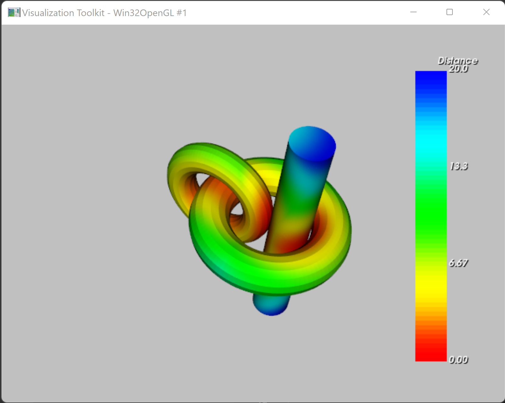

# Affera Sample Project
## Pre-requisites
Install required Python modules

`pip install -r requirements.txt`

## To Run
`python process.py -h`
```
usage: process.py [-h] [-t TOLERANCE] [-d] in_file

positional arguments:
  in_file               input file containing csv verts

options:
  -h, --help            show this help message and exit
  -t TOLERANCE, --tolerance TOLERANCE
                        tolerance to apply poly data cleanup
  -d, --distance        calculate and render distance
  ```

example 1:

`python process.py vertices.txt`



example 2:

`python process.py vertices.txt -d`



## Summary
There were three meshes to be segment:

```
INFO:__main__:Joined connected meshes vtkPolyDataConnectivityFilter (000001F49FE67D70)
  Debug: Off
  Modified Time: 200626
  Reference Count: 2
  Registered Events: (none)
  Executive: 000001F4B9135BF0
  ErrorCode: No error
  Information: 000001F4B994E550
  AbortExecute: Off
  Progress: 1
  Progress Text: (None)
  Extraction Mode: ExtractAllRegions
  Closest Point: (0, 0, 0)
  Color Regions: On
  Scalar Connectivity: Off
  Mark visited point ids: Off
  Scalar Range: (0, 1)
  RegionSizes:
    0: 396
    1: 3328
    2: 3328
  Output Points Precision: 2
  ```

  ## Software Model
  I leveraged VTK, so most of the operations were encapsulated and code is just connecting inputs to outputs as in a pipeline. I did create one method for parsing the csv file, leveraging numpy for its csv and array reshaping functionality.

   ## Test Plan
   * Test collections that have no data.

   * Test collections that have multiple instances of the exact same data.

   * Test collections with known closed quanties of closed surfaces.

   * Test very large data input files.
   